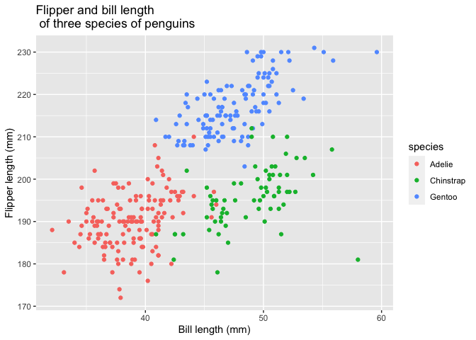

P8105\_HW1\_jlh2270
================
Juyoung Hahm
9/13/2020

# Problem 1

Create a dataframe that consists: random sample of size 10 from a
standard Normal distribution, a logical vector indicating whether
elements of the sample are greater than 0, a character vector of length
10, and a factor vector of length 10, with 3 different factor “levels”.

``` r
sample_df = tibble(
  sample_rnorm = rnorm(10),
  sample_logical = sample_rnorm > 0,
  sample_char = c("a","b","c","d","e","f","g","h","i","j"),
  sample_factor = factor(c("high","middle","low","high","middle","low","high",
                    "middle","low","middle"))
)
```

Here are the means of `sample_df`.

  - `sample_rnorm` mean is -0.0359181.
  - `sample_logical` mean is 0.5.
  - `sample_char` mean is NA.
  - `sample_factor` mean is NA.

We cannot find the mean of the character vector and factor vector.

``` r
as.numeric(sample_df$sample_logical)
as.numeric(sample_df$sample_char)
as.numeric(sample_df$sample_factor)
```

When applying the function `as.numeric` to the logical, character and
factor vector, we can see that logical and factor vectors turn into
numbers, but for the character vector, it still comes out as NA. With
this, we know that we canfind the mean of logical and factor vectors
using `as.numeric`.

Next, we are going to convert logical vector to other data types and
multiply the random sample by the result.

``` r
as.numeric(sample_df$sample_logical) * sample_df$sample_rnorm
as.factor(sample_df$sample_logical) * sample_df$sample_rnorm
as.numeric( as.factor(sample_df$sample_logical)) * sample_df$sample_rnorm
```

  - After converting the logical vector to numeric, and multiply the
    random sample by the result, we get:

0.1676953, 0, 0, 0.2581854, 0, 0, 0.1090448, 0, 3.6464652, 0.3936129

  - After converting the logical vector to a factor, and multiply the
    random sample by the result, we get:

NA, NA, NA, NA, NA, NA, NA, NA, NA, NA

  - After converting the logical vector to a factor and then convert the
    result to numeric, and multiply the random sample by the result, we
    get:

0.3353906, -2.6738968, -0.2189635, 0.5163709, -0.3157169, -1.4784196,
0.2180895, -0.2471879, 7.2929304, 0.7872258

# Problem 2

Load the `penguins` dataset:

``` r
data("penguins", package = "palmerpenguins")
penguins_new = na.omit(penguins)
```

Looking at the data, there are 3 categorical and 5 numerical variables.
we can see there are 3 different `species`: Adelie, Gentoo, Chinstrap.
This data was collected from 3 different `island`: Biscoe, Dream,
Torgersen. There’s also a `sex` (Male/Female) variable.For numerical
variables, there’s`bill_length_mm`, `bill_depth_mm`,
`flipper_length_mm`, `body_mass_g`, and `year`. We are most likely to
see the relationship between bill length, bill depth, flipper length and
body mass.

There are 2752 data sets. After deleting the NA data, we now have 2664
data sets.

The mean of each numerical variables are:

  - `bill_length_mm`: 43.9927928
  - `bill_depth_mm`: 17.1648649.
  - `flipper_length_mm`: 200.966967.
  - `body_mass_g`: 4207.0570571.

To see a precise relationship, we are going to make a scatterplot of
`flipper_length_mm` vs `bill_length_mm`.

``` r
ggplot(penguins_new, aes(x = bill_length_mm, y = flipper_length_mm, color = species))  + labs(y = "Flipper length (mm)", x = "Bill length (mm)", title = "Flipper and bill length \n of three species of penguins") + geom_point()
```

<!-- -->
